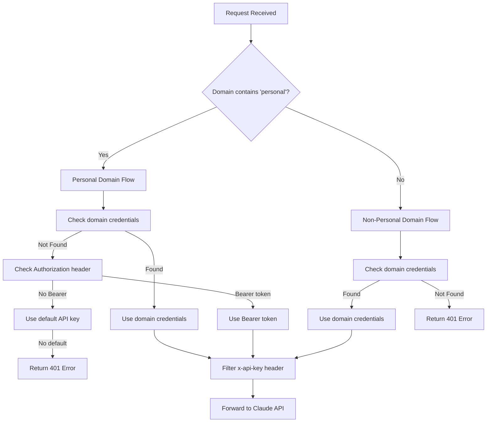

# Safer API Key Implementation

## Overview

This document describes the enhanced security implementation for API key handling in Claude Nexus Proxy.

## Changes

### 1. Removed x-api-key Header Support

- **What changed**: The proxy no longer accepts or forwards `x-api-key` headers
- **Why**: To prevent accidental exposure of API keys to Claude's servers
- **Impact**: All authentication must now use Bearer tokens in the Authorization header

### 2. Domain-Based Authorization Logic

The proxy now enforces different authentication rules based on domain type:

#### Personal Domains

Domains containing the word "personal" (case-insensitive):

- Can use domain-specific credentials (if configured)
- Can use Bearer tokens from Authorization header
- Can fall back to default API key (CLAUDE_API_KEY env var)

Examples:

- `personal.com`
- `my-personal-site.com`
- `personal-blog.net`
- `site.personal.io`

#### Non-Personal Domains

All other domains:

- **MUST** have domain-specific credentials configured
- Bearer tokens from requests are ignored
- No fallback to default API key
- Returns 401 error if credentials are missing

Examples:

- `company.com`
- `api.service.com`
- `example.com`

## Authentication Flow



## Security Improvements

### 1. Header Filtering

```typescript
// x-api-key is always filtered out before sending to Claude
const { 'x-api-key': _, ...filteredHeaders } = authHeaders
```

### 2. Request Context

- Only accepts Bearer tokens from Authorization header
- Ignores x-api-key header completely

### 3. Domain Validation

- Validates domain names to prevent path traversal
- Case-insensitive matching for "personal" keyword

## Migration Guide

### For Personal Domains

No breaking changes. The following still work:

1. Domain credentials in `<domain>.credentials.json`
2. Bearer tokens in Authorization header
3. Default API key fallback

### For Non-Personal Domains

**Breaking Change**: Must configure domain credentials.

1. Create credential file:

```bash
cat > credentials/company.com.credentials.json << EOF
{
  "type": "api_key",
  "api_key": "sk-ant-your-api-key"
}
EOF
```

2. Or use OAuth:

```bash
cat > credentials/company.com.credentials.json << EOF
{
  "type": "oauth",
  "oauth": {
    "accessToken": "your-access-token",
    "refreshToken": "your-refresh-token",
    "expiresAt": 1234567890000,
    "scopes": ["user:inference"],
    "isMax": false
  }
}
EOF
```

## Error Messages

### Personal Domains

```json
{
  "error": {
    "code": "AUTHENTICATION_ERROR",
    "message": "No valid credentials found"
  },
  "hint": "For personal domains: create a credential file or pass Bearer token in Authorization header"
}
```

### Non-Personal Domains

```json
{
  "error": {
    "code": "AUTHENTICATION_ERROR",
    "message": "No credentials configured for domain"
  },
  "hint": "Domain credentials are required for non-personal domains"
}
```

## Testing

Run the new test suite:

```bash
bun test tests/safer-auth.test.ts
```

## Environment Variables

- `CLAUDE_API_KEY`: Default API key (only used for personal domains)
- `CREDENTIALS_DIR`: Directory for domain credential files (default: `credentials`)
- `ENABLE_CLIENT_AUTH`: Enable client authentication middleware (default: `true`)
