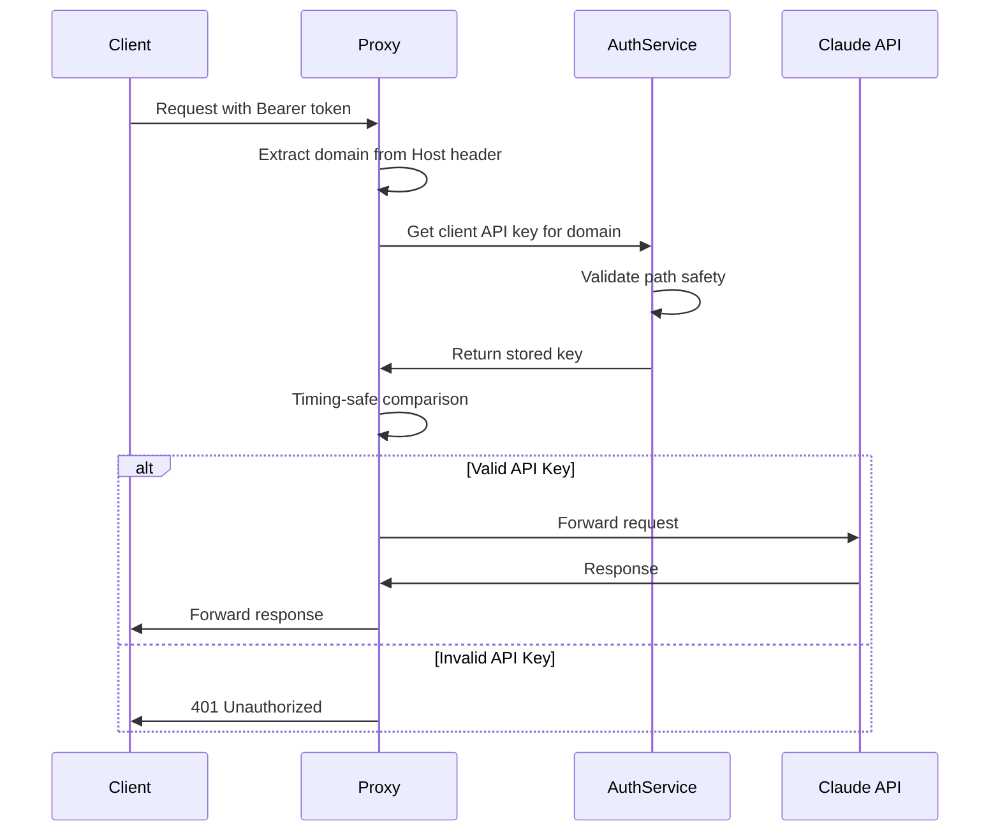

# Security Implementation Details

## Overview

This document details the security implementation for domain-specific API key authentication in Claude Nexus Proxy.

## Threat Model

### Threats Addressed

1. **Unauthorized Proxy Usage**
   - **Threat**: Attackers discovering proxy endpoint could use it without authorization
   - **Mitigation**: Domain-specific API keys required for access

2. **Path Traversal Attacks**
   - **Threat**: Malicious Host headers like `../../../etc/passwd` to read arbitrary files
   - **Mitigation**: Path sanitization and validation in `getSafeCredentialPath()`

3. **Timing Attacks**
   - **Threat**: Measuring response times to guess valid API keys character by character
   - **Mitigation**: SHA-256 hashing before timing-safe comparison

4. **Host Header Injection**
   - **Threat**: Using missing or spoofed Host headers to bypass authentication
   - **Mitigation**: Reject requests without Host header, ignore X-Forwarded-Host

## Implementation Details

### Path Traversal Protection

```typescript
private getSafeCredentialPath(domain: string): string | null {
  // 1. Use path.basename() to remove directory components
  const safeDomain = path.basename(domain)
  
  // 2. Validate characters (alphanumeric, dots, hyphens only)
  if (!/^[a-zA-Z0-9.-]+$/.test(safeDomain)) {
    return null
  }

  // 3. Resolve to absolute paths
  const credentialsDir = path.resolve(this.credentialsDir)
  const credentialPath = path.resolve(credentialsDir, `${safeDomain}.credentials.json`)

  // 4. Ensure path stays within credentials directory
  if (!credentialPath.startsWith(credentialsDir + path.sep)) {
    logger.error('Path traversal attempt detected', { domain })
    return null
  }

  return credentialPath
}
```

### Timing Attack Prevention

```typescript
// Hash both values to ensure fixed length (32 bytes)
const tokenHash = await crypto.subtle.digest('SHA-256', tokenBuffer)
const keyHash = await crypto.subtle.digest('SHA-256', keyBuffer)

// Use Node.js timing-safe comparison
const isValid = cryptoTimingSafeEqual(
  Buffer.from(tokenHash),
  Buffer.from(keyHash)
)
```

### Authentication Flow



## Security Best Practices

### 1. Key Generation

- Use 32 bytes of cryptographic randomness
- Base64URL encoding for transport safety
- Meaningful prefixes for key identification

### 2. Key Storage

- Store in files with restricted permissions (600)
- Never commit real keys to version control
- Use environment-specific credential directories

### 3. Key Rotation

- Implement regular rotation schedule
- Support multiple valid keys during rotation
- Log key usage for audit trails

### 4. Monitoring

Authentication failures are logged with:
- Timestamp
- Source IP address
- Requested domain
- Request path

Example log entry:
```json
{
  "level": "warn",
  "msg": "Client auth middleware: Invalid API key",
  "requestId": "req_123456",
  "domain": "example.com",
  "path": "/v1/messages",
  "ip": "192.168.1.100"
}
```

### 5. Rate Limiting

Client authentication runs BEFORE rate limiting to:
- Prevent unauthenticated requests from consuming rate limit quota
- Protect against brute force attacks
- Reduce load from unauthorized traffic

## Testing Security

### Test Coverage

1. **Path Traversal Tests**
   - Various injection patterns
   - URL encoding attempts
   - Null byte injection
   - Valid domains with dots

2. **Authentication Tests**
   - Valid/invalid keys
   - Missing headers
   - Malformed headers
   - Empty keys

3. **Security Feature Tests**
   - Timing-safe comparison
   - Host header validation
   - Error handling

### Running Security Tests

```bash
# Run all security tests
bun test tests/client-auth.test.ts

# Test path traversal specifically
bun test tests/client-auth.test.ts -t "Path Traversal"
```

## Incident Response

### If API Key is Compromised

1. Generate new API key immediately
2. Update credential file
3. Review logs for unauthorized usage
4. Notify affected users
5. Consider implementing IP allowlisting

### If Path Traversal is Detected

1. Alert is logged automatically
2. Request is rejected
3. Review logs for attack patterns
4. Consider blocking source IPs
5. Verify no files were exposed

## Future Enhancements

1. **Key Rotation API** - Automated key rotation endpoint
2. **IP Allowlisting** - Restrict keys to specific IP ranges
3. **Key Scoping** - Limit keys to specific models or endpoints
4. **Usage Quotas** - Per-key rate limiting and quotas
5. **HMAC Signatures** - Request signing for additional security