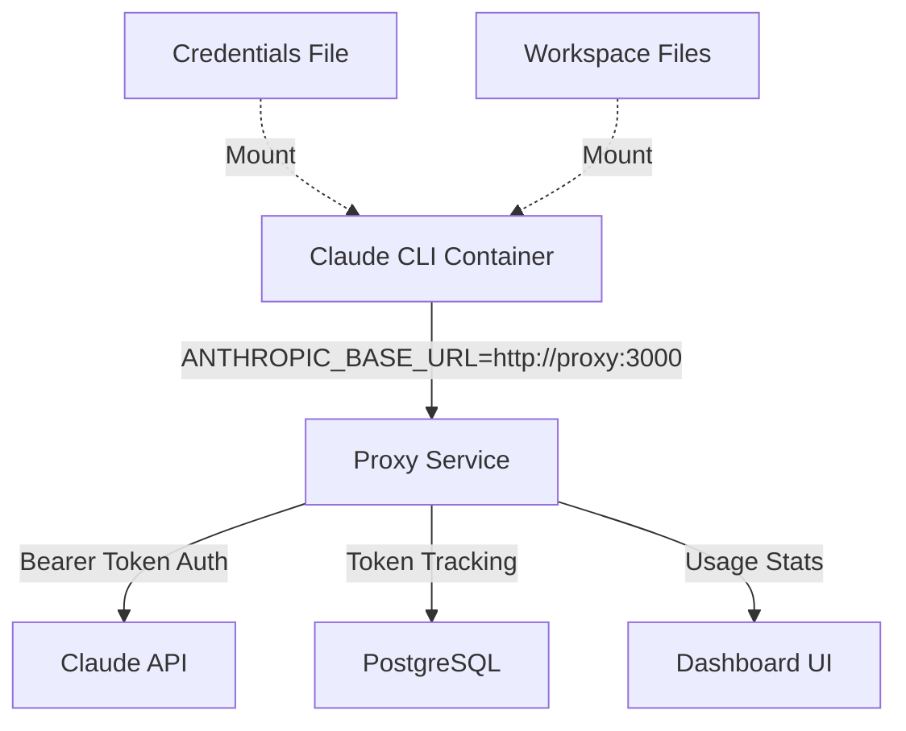

# Claude CLI Docker Integration

This directory contains the Docker setup for running [Claude CLI](https://github.com/anthropics/claude-cli) through the Claude Nexus Proxy, enabling token tracking, usage monitoring, and centralized authentication management.

## Table of Contents

- [Overview](#overview)
- [Prerequisites](#prerequisites)
- [Architecture](#architecture)
- [Quick Start](#quick-start)
- [Configuration](#configuration)
- [Usage](#usage)
  - [Claude CLI Commands](#claude-cli-commands)
  - [Token Monitoring](#token-monitoring)
  - [File Operations](#file-operations)
- [Security Considerations](#security-considerations)
- [Troubleshooting](#troubleshooting)
- [Technical Details](#technical-details)

## Overview

The Claude CLI Docker integration provides:

- **Containerized Claude CLI**: Run Anthropic's official CLI tool in an isolated environment
- **Automatic Token Tracking**: All CLI usage is tracked through the proxy
- **Usage Monitoring**: Real-time and historical token usage visualization
- **Centralized Authentication**: Manage API keys and OAuth tokens in one place
- **Cross-Platform Compatibility**: Works identically on Linux, macOS, and Windows (with Docker)

## Prerequisites

- Docker Engine 20.10+ and Docker Compose 2.0+
- Valid Claude API credentials (API key or OAuth token)
- Access to the proxy service (running on port 3000)

## Architecture



The Claude CLI runs in a Docker container that:

1. Routes all API requests through the proxy service
2. Automatically extracts authentication from credential files
3. Provides usage monitoring tools (ccusage, monitor)
4. Maintains isolation from the host system

## Quick Start

```bash
# 1. Ensure services are running
./docker-up.sh up -d

# 2. Run a Claude query
./docker-up.sh exec claude-cli claude "Explain Docker containers"

# 3. Check token usage
./docker-up.sh exec claude-cli ccusage daily
```

## Configuration

### Credential Setup

Create a credentials file at `client-setup/.credentials.json`:

```json
{
  "type": "oauth",
  "oauth": {
    "accessToken": "your-access-token",
    "refreshToken": "your-refresh-token",
    "expiresAt": "2024-12-31T23:59:59Z"
  }
}
```

Or for API key authentication:

```json
{
  "type": "api_key",
  "api_key": "sk-ant-..."
}
```

### Environment Variables

The container uses these environment variables:

| Variable             | Default                | Description                    |
| -------------------- | ---------------------- | ------------------------------ |
| `ANTHROPIC_BASE_URL` | `http://proxy:3000`    | Proxy service URL              |
| `CLAUDE_HOME`        | `/home/claude/.claude` | Claude configuration directory |

## Usage

### Claude CLI Commands

```bash
# Interactive mode
./docker-up.sh exec claude-cli claude

# Single query
./docker-up.sh exec claude-cli claude "What is the meaning of life?"

# With context from stdin
echo "Fix this code: console.log('hello world)" | ./docker-up.sh exec claude-cli claude

# Using the project root helper script
./claude "Explain async/await in JavaScript"
```

### Token Monitoring

Monitor your Claude API usage in real-time:

```bash
# Real-time token usage monitor
./docker-up.sh exec claude-cli monitor

# Daily usage statistics
./docker-up.sh exec claude-cli ccusage daily

# Weekly usage report
./docker-up.sh exec claude-cli ccusage weekly

# Monthly summary
./docker-up.sh exec claude-cli ccusage monthly
```

### File Operations

Work with files from your host system:

```bash
# Analyze a file (mounted via workspace volume)
./docker-up.sh run --rm claude-cli claude "Review this code" < myfile.py

# Process multiple files
./docker-up.sh run --rm -v $(pwd):/workspace claude-cli claude \
  "Compare these implementations" /workspace/impl1.js /workspace/impl2.js
```

## Security Considerations

1. **Credential Storage**: Credentials are mounted read-only and copied to the container's home directory
2. **Non-Root User**: The container runs as the `claude` user (UID 1001) for security
3. **Network Isolation**: Communication stays within the Docker network
4. **No Persistent Storage**: Container state is ephemeral by default

**Best Practices:**

- Never commit credential files to version control
- Use environment-specific credential files
- Rotate API keys regularly
- Monitor usage for anomalies

## Troubleshooting

### Common Issues

**Container fails to start:**

```bash
# Check container logs
./docker-up.sh logs claude-cli

# Verify credentials file exists
ls -la client-setup/.credentials.json
```

**Authentication errors:**

```bash
# Verify credentials format
cat client-setup/.credentials.json | jq .

# Check proxy connectivity
./docker-up.sh exec claude-cli curl -s http://proxy:3000/health
```

**Permission issues:**

```bash
# Ensure proper file permissions
chmod 600 client-setup/.credentials.json

# Check container user
./docker-up.sh exec claude-cli whoami  # Should output: claude
```

**Monitor not working:**

```bash
# Verify Python installation
./docker-up.sh exec claude-cli python3 --version

# Check monitor script location
./docker-up.sh exec claude-cli ls -la /app/claude-monitor/
```

### Debug Mode

Enable debug output for troubleshooting:

```bash
# Run with debug logging
DEBUG=true ./docker-up.sh exec claude-cli claude "test query"
```

## Technical Details

### Container Components

- **Base Image**: `node:24-alpine` (lightweight Node.js environment)
- **Claude CLI**: Installed via npm as `@anthropic-ai/claude-code`
- **ccusage**: Token usage tracking tool
- **Claude Monitor**: Python-based real-time usage monitor

### File Structure

```
docker/claude-cli/
├── Dockerfile              # Multi-stage build configuration
├── entrypoint.sh          # Container entry point and routing
├── claude-wrapper.sh      # API key extraction and CLI execution
├── monitor-wrapper.sh     # Monitor environment setup
├── README.md              # This file
└── CLAUDE_MONITOR_INTEGRATION.md  # Technical implementation details
```

### Integration Points

- **Proxy Integration**: All requests routed through `http://proxy:3000`
- **Dashboard Integration**: Usage appears under "localhost" domain
- **Database Integration**: Token usage stored in PostgreSQL

For more technical details about the monitor integration, see [CLAUDE_MONITOR_INTEGRATION.md](./CLAUDE_MONITOR_INTEGRATION.md).

For architectural decisions, see [ADR-010: Docker-Based Claude CLI Integration](../../docs/04-Architecture/ADRs/adr-010-docker-cli-integration.md).
