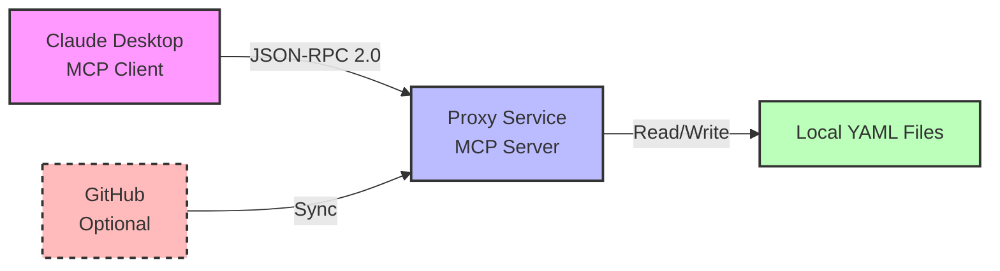

# ADR-017: MCP Prompt Sharing Implementation

## Date

2024-12-10

## Status

Accepted and Implemented

## Context

Claude Nexus Proxy needed a way to share and manage prompts across different Claude instances and teams. The existing approach required manual prompt management and lacked standardization, leading to duplicated efforts and inconsistent prompt quality across teams.

The Model Context Protocol (MCP) provides a standardized way to serve prompts that can be consumed by Claude Desktop and other MCP-compatible clients, offering a solution to these challenges.

## Decision

We decided to implement an MCP server within the existing proxy service using a file-based approach rather than the database-backed solution initially proposed in ADR-016.

The implementation:

1. **Serves prompts via JSON-RPC 2.0 protocol** following the MCP specification
2. **Uses a hybrid storage approach**: local YAML files with optional GitHub synchronization
3. **Integrates with Claude Desktop** via `mcp-remote` HTTP transport
4. **Provides dashboard UI** for prompt management and sync status

### Alternatives Considered

1. **Database-Backed MCP Server (ADR-016)**
   - **Pros**: Centralized storage, built-in persistence, easier analytics
   - **Cons**: Database migrations, operational complexity, latency overhead
   - **Rejected because**: The benefits didn't justify the added complexity for our use case

2. **Separate MCP Service**
   - **Pros**: Independent scaling, service isolation
   - **Cons**: Additional deployment complexity, inter-service communication
   - **Rejected because**: Violated our principle of keeping the proxy as a single deployable unit

3. **Direct GitHub Integration Only**
   - **Pros**: No local storage needed, single source of truth
   - **Cons**: GitHub API rate limits, network dependency, no offline development
   - **Rejected because**: Would prevent local development and testing

### Why File-Based Approach Won

We chose the file-based approach because:

- **Simplicity**: No database schema changes or migrations required
- **Developer Experience**: Hot-reloading and direct file editing
- **Version Control**: Native Git integration for prompt history
- **Lower Latency**: No database query overhead
- **Operational Simplicity**: One less system to monitor and maintain

### Architecture

The implementation consists of three main components:



_Note: If Mermaid rendering is not supported, see ASCII diagram below:_

```
┌─────────────────────┐     ┌──────────────────┐     ┌─────────────────┐
│   Claude Desktop    │────▶│   Proxy Service  │◀────│     GitHub      │
│  (MCP Client)       │     │   (MCP Server)   │     │  (Optional)     │
└─────────────────────┘     └──────────────────┘     └─────────────────┘
                                      │
                                      ▼
                            ┌──────────────────┐
                            │  Local YAML      │
                            │  Files           │
                            └──────────────────┘
```

### Key Design Decisions

1. **File-Based Storage**: Prompts are stored as YAML files in the `prompts/` directory
   - Simple format: `name`, `description`, `template`
   - Handlebars templating for variable substitution
   - Hot-reloading for development

2. **Optional GitHub Sync**: When configured, syncs prompts from a GitHub repository
   - Non-destructive sync (preserves local-only files)
   - Security measures against path traversal
   - Periodic sync with configurable interval

3. **Authentication**: Uses existing proxy authentication
   - Bearer token required for MCP endpoint access
   - Same client API key used for proxy requests

4. **Protocol Compliance**: Implements MCP protocol version `2024-11-05`
   - Required for Claude Desktop compatibility
   - Supports `initialize`, `prompts/list`, and `prompts/get` methods

### Configuration

```bash
# Basic setup (local files only)
MCP_ENABLED=true
MCP_PROMPTS_DIR=./prompts
MCP_WATCH_FILES=true

# With GitHub sync
MCP_GITHUB_OWNER=your-org
MCP_GITHUB_REPO=prompt-library
MCP_GITHUB_BRANCH=main
MCP_GITHUB_TOKEN=ghp_xxxx
MCP_GITHUB_PATH=prompts/
MCP_SYNC_INTERVAL=300
```

### Claude Desktop Integration

Users can add the MCP server to Claude Desktop with:

```bash
claude mcp add nexus-prompts --scope user -- bunx -y mcp-remote@latest \
  http://localhost:3000/mcp --header "Authorization: Bearer YOUR_CLIENT_API_KEY"
```

## Consequences

### Positive

- **Standardized prompt sharing** across teams using MCP protocol
- **Simple deployment** - no database changes required
- **Developer friendly** - hot-reloading and YAML format
- **Secure by default** - authentication required, path traversal protection
- **Flexible storage** - works with local files or GitHub repository
- **Low operational overhead** - no additional database tables or background jobs
- **Version control friendly** - prompts can be tracked in Git

### Negative

- **No usage analytics** - simplified design omits tracking prompt usage
- **Manual distribution** - prompts must be synced manually across instances without GitHub
- **Limited features** - no built-in argument validation or versioning
- **Memory constraints** - all prompts loaded into memory (though unlikely to be an issue)
- **No persistence** - server restart loses any runtime state

### Neutral

- **Protocol-first approach** ensures compatibility with future MCP clients
- **Hybrid architecture** allows gradual adoption (start local, add GitHub later)
- **Trade-off accepted** - simplicity over feature completeness

## Implementation Details

The MCP server is implemented in the following key files:

- `services/proxy/src/mcp/` - Core MCP server implementation
- `services/proxy/src/services/prompt-registry.ts` - Prompt management service
- `services/proxy/src/services/github-sync.ts` - Optional GitHub synchronization
- `services/dashboard/src/components/MCPStatus.tsx` - Dashboard UI component

## References

- [Model Context Protocol Specification](https://modelcontextprotocol.io)
- [ADR-016: MCP Server Implementation (Superseded)](./adr-016-mcp-server-implementation.md)
- Implementation commit: See git history for December 2024 MCP implementation
